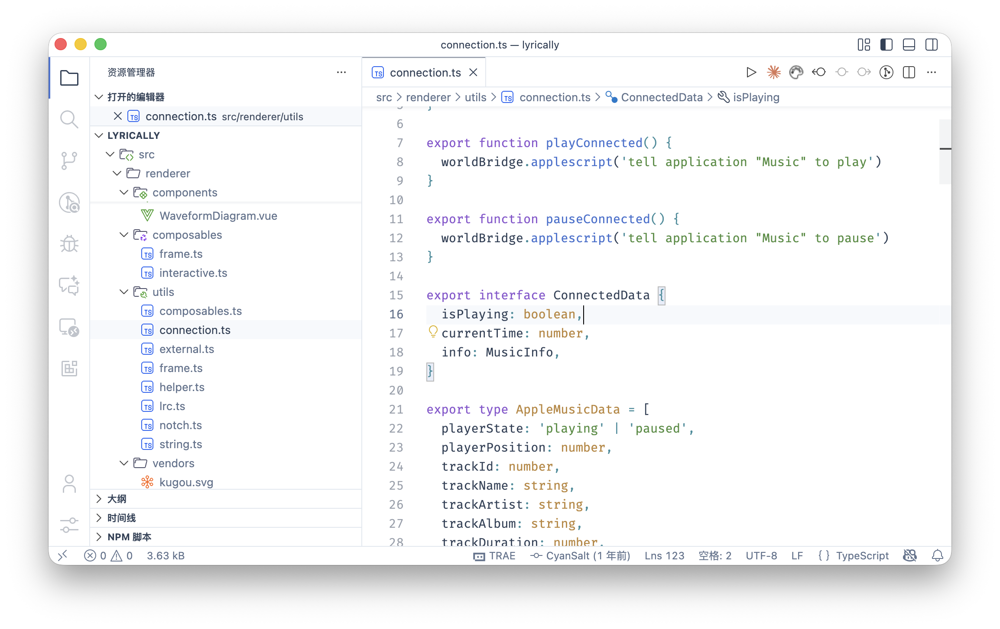
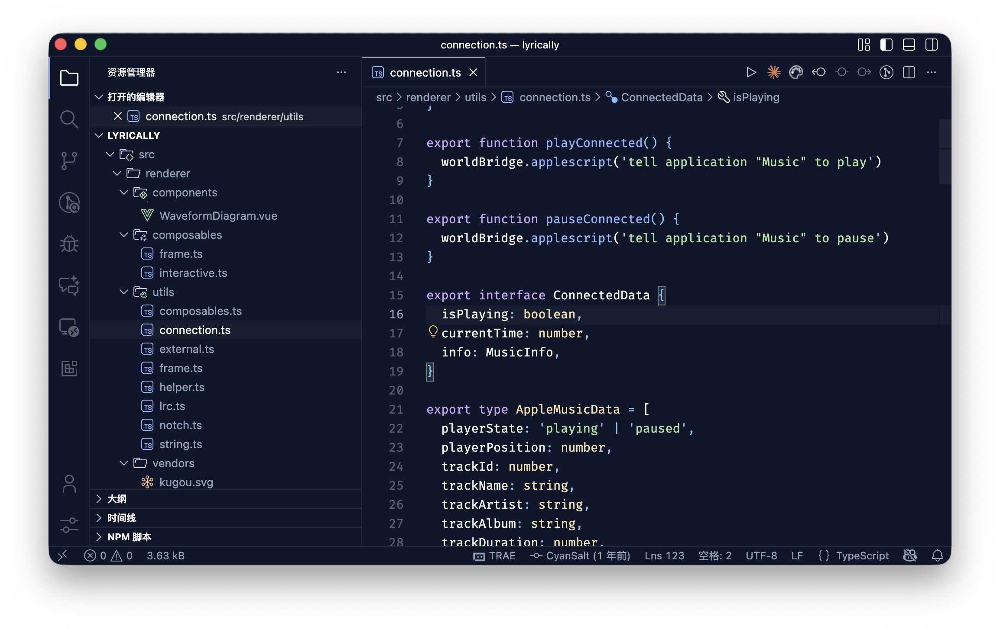

# vscode-theme-porcelain

[](https://marketplace.visualstudio.com/items?itemName=cyansalt.vscode-theme-porcelain)
[](https://open-vsx.org/extension/cyansalt/vscode-theme-porcelain)

<p align="center">
<br>
<br>

</p>

Inspired by
- Interface contrast from [Vitesse Theme](https://github.com/antfu/vscode-theme-vitesse)
- Hue of the token coloring from [Boxy Theme Kit](https://github.com/trongthanh/vscode-boxythemekit)
- Palette modified from [Catppuccin](https://github.com/catppuccin/catppuccin)
- Color levels of foreground and background from [Nuxt UI](https://ui.nuxt.com/).

## Usage

```jsonc
// .vscode/setting.json
{
  "window.autoDetectColorScheme": true,
  "workbench.preferredLightColorTheme": "Porcelain Light",
  "workbench.preferredDarkColorTheme": "Porcelain Dark",
}
```

## Recommendation

- File Icon Theme: [Catppuccin](https://marketplace.visualstudio.com/items?itemName=Catppuccin.catppuccin-vsc-icons) (Latte for light, Mocha for dark)
- Product Icon Theme: [Carbon](https://marketplace.visualstudio.com/items?itemName=antfu.icons-carbon)

```jsonc
// .vscode/setting.json
{
  "workbench.iconTheme": "catppuccin-latte",
  "workbench.productIconTheme": "icons-carbon"
}
```

Additionally, we recommend using [Dynamic Icon Theme](https://marketplace.visualstudio.com/items?itemName=manuthebyte.dynamic-icon-theme) to change tour icon theme dynamically.

```jsonc
// .vscode/setting.json
{
  "icontheme.darkIconTheme": "catppuccin-mocha",
  "icontheme.lightIconTheme": "catppuccin-latte"
}
```
